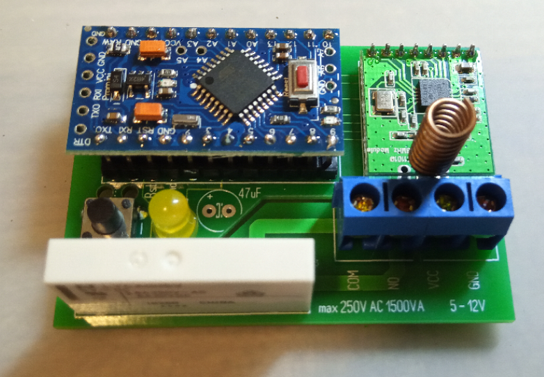

# HM-LC-Sw1-PCB
# 1x 6A 230V Schaltkontakt; Steuerspannung 5-12V 

## benötigte Hardware
* 1x Arduino Pro Mini **ATmega328P (3.3V/8MHz)**
* 1x CC1101 Funkmodul **(868 MHz)**
* 1x FTDI Adapter (wird nur zum Flashen benötigt)

* 1x https://www.reichelt.de/my/1515334

<<<<<<< HEAD
ACHTUNG: ja nach Hersteller der Arduinos kann die maximale Eingangsspannung variieren. (Siehe Datenblatt) Falls keins vorhanden ist, maximale Spannung an VCC 8,5V!

[Software je nach Projekt](https://github.com/jp112sdl) von JÈrÙme
=======
[Software je nach Projekt](https://github.com/jp112sdl) von Jérôme
>>>>>>> cbd571aa84ae32462f6a2df83f63f17dc368ef17

